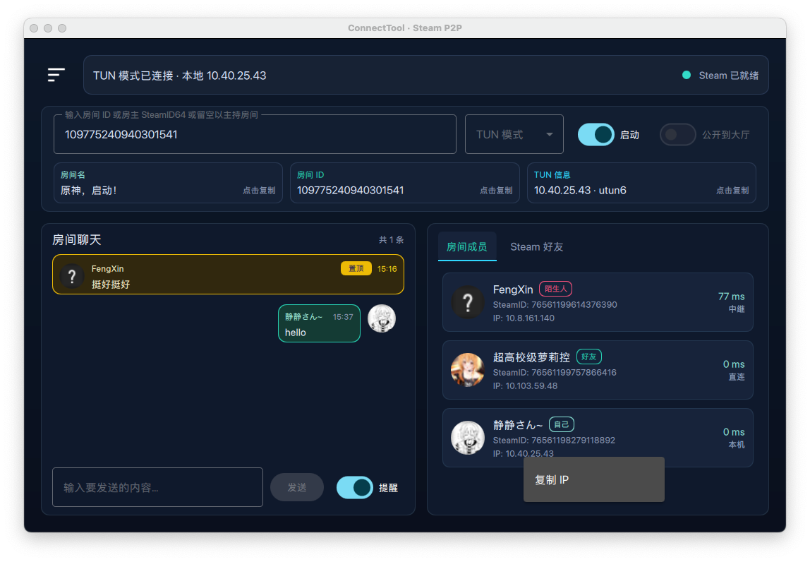
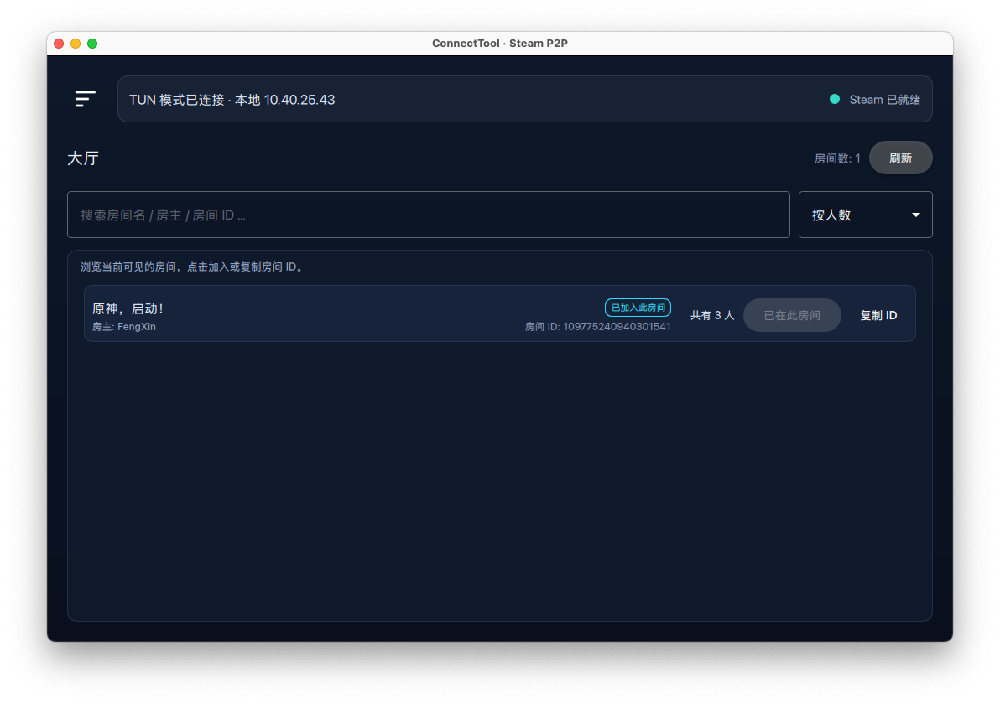
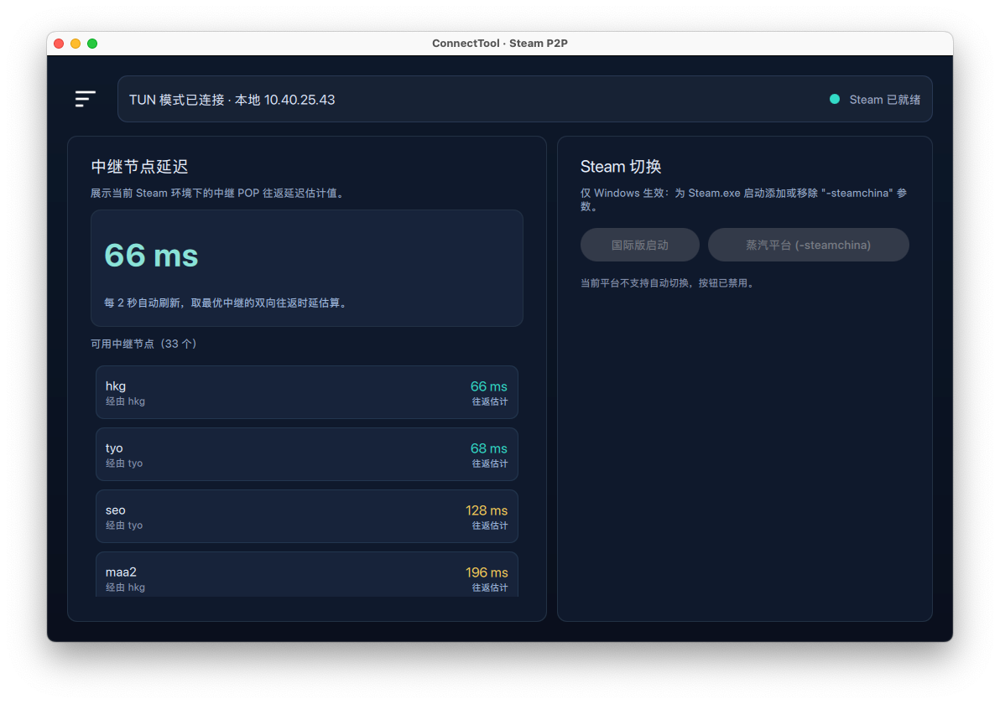
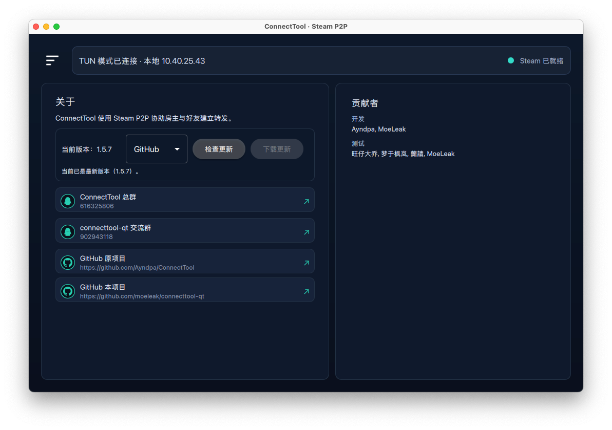

# connecttool-qt

基于 Qt 重新开发的 UI 界面，让联机更加简单。

## 特性

- 跨平台支持良好，支持 Windows/Linux/MacOS，Android版本开发中...
- 去中心化（使用Steam Lobby）即可实现公布房间到大厅

 
 

## 傻瓜式视频教程

B站[链接](https://www.bilibili.com/video/BV1geS4BUEKy)

## Windows

编译好的二进制文件在
[Release](https://github.com/moeleak/connecttool-qt/releases) 页面可以看到

## Linux/MacOS

首先安装好 `nix` 包管理器

```
$ curl -sSf -L https://install.lix.systems/lix | sh -s -- install
```

下载 [Steamworks SDK](https://partner.steamgames.com/downloads/list)

设置环境变量

```
$ export STEAMWORKS_SDK_DIR=/your/path/to/sdk
```

然后直接执行

```
$ nix run github:moeleak/connecttool-qt --impure
```

> **Apple Silicon 提示（arm64）：** Steamworks 目前只提供 x86_64 的
> `libsteamwebrtc.dylib`，要启用 ICE 直连需要在 Rosetta 下构建/运行 x86_64
> 版本。
>
> 1. 在 `/etc/nix/nix.conf` 配置
>    `extra-platforms = x86_64-darwin aarch64-darwin` 后重启 nix-daemon
>    `sudo launchctl kickstart -k system/org.nixos.nix-daemon`
> 2. 构建：`nix build .#packages.x86_64-darwin.default --impure -L`
> 3. 运行：`arch -x86_64 ./result/bin/connecttool-qt`
